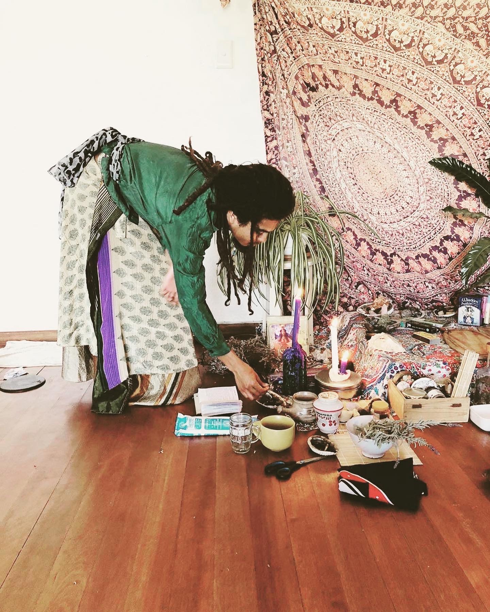

<h6 style="text-align: center; font-weight: bold;">Including Ceremony into Daily Living</h6>

ixCacao Journeys is a birth from my own journey of health since the time cacao entered my life. To share the embodiment teachings of ixCacao, I had to live in a way that truly honours the process of being Human.

What does this mean? Living in awareness that All things are sacred. Through recognising that each moment is a ceremony where we can drop our masks and be fully present, is the catalyst for sustainable, everlasting growth. In a conscious way, we can create new ways (habits) of engaging in the world that uplifts our experiences and moves us to achieving what we really desire and aspire towards.

These journeys were created with the intention to support the integration of the medicinal plant teachings so that we can embody the fullness they bring for us. When we journey with an intention for a certain period of time, we can allow time for our bodies to encode the shifting and wisdom. It gives time for new pathways to form in the body. Experiences and feelings through the body are important factors of the embodiment journey.
These journeys intend for you to experience the sensations and healing of daily spiritual practices coupled with medicinal foods. New outcomes (magic) in life naturally begin to arise as we forge new pathways within the body. The prayer is that this sparks inspiration in your own Being to keep nurturing this embodiment journey. The wisdom of the plants received; are keys to finding how this could feed your life and your beloveds around you.

    <ul class="blocks-gallery-grid columns-2" style="justify-content: center;">
        <li class="blocks-gallery-item">
            <figure>
                    
            </figure>
        </li>
    </ul>

<h6 style="text-align: center; font-weight: bold;">Sustainable Steps Into Healthy Living</h6>

Nutritional Technology is a concept of breaking down the many facets of healthy living and learning how to apply that in our own lives for personal mastery. When we have cultivated a beautiful relationship with our own body, it becomes easier to listen to how to nourish it. Living from a place of our own Truth, rather than what science says is "healthy", is what Nutritional Technology is all about.

<h6 style="text-align: center; font-weight: bold;">A Global Sacred Container</h6>

Each journey will be held within sacred space and maintained primarily by Matthew Gabriel, the facilitator, until it has been completed. A sacred container is an energetic field coded with specific prayers and intentions for each journey. Within this field, we become connected and share an intimate process together. ixCacao will be our main plant ally and guide during this container. In the comfort of your own home and sacred space, you will be able to safely journey with ixCacao with the guidance of your own ancestors, plant allies, and spirit guides.

    <ul class="blocks-gallery-grid columns-2" style="justify-content: center;">
        <li class="blocks-gallery-item">
            <figure>
                    
            </figure>
        </li>
    </ul>

